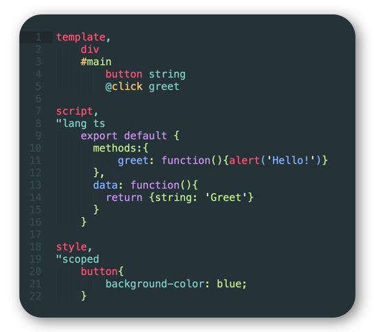

# Louk Grammar
Syntax highlighting for [Louk](https://www.louk-lang.org)

## Installation
Install via the Sublime [Package Manager](https://sublime.wbond.net/installation).
1. Open the Command Palette (`⌘+shift+p` on Mac, `ctrl+shift+p` on Windows)
2. Type `install`, then choose `Package Control: Install Package`
3. Type `louk` and select it.

## About
This package/repository is purely a distribution mechanism for build outputs from the [louk-grammar](https://github.com/agorischek/louk-grammar) repository. Contributions and modifications should be made in that repository.

